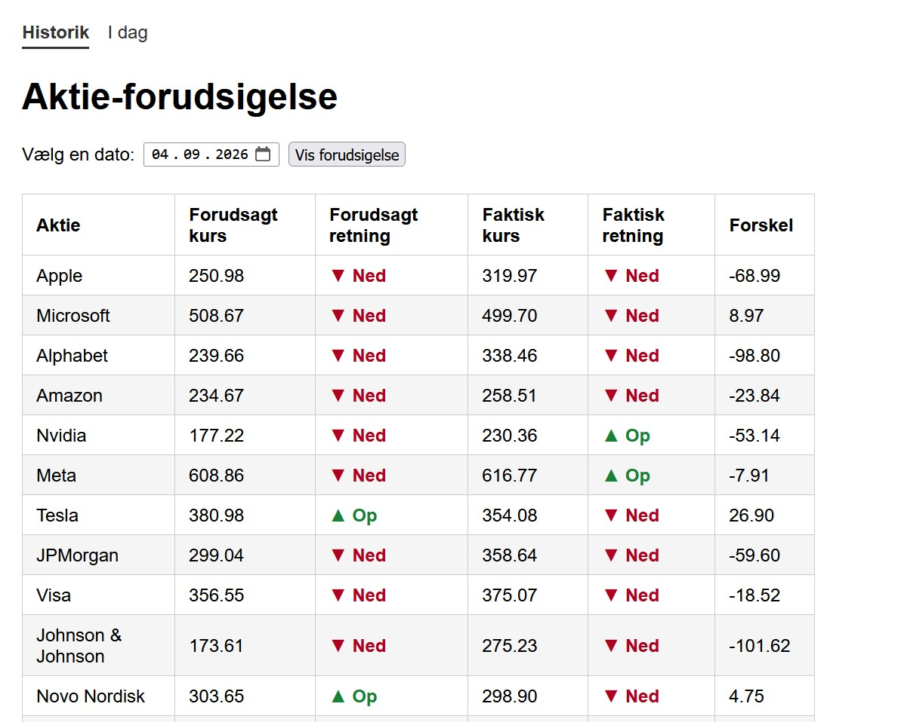
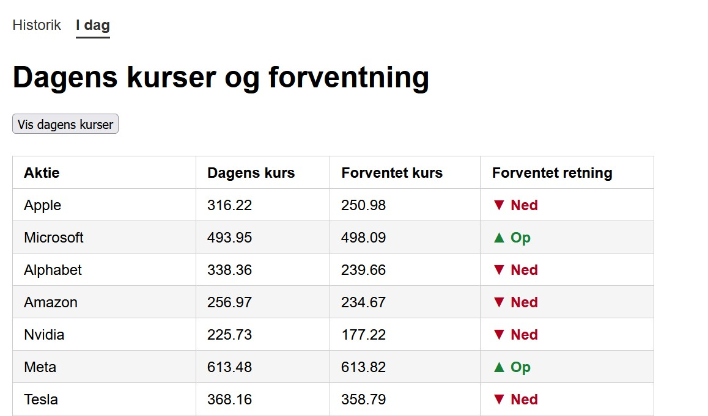
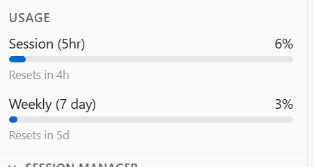

# Stock site with Claude
Given (general) specifications, Claude coded a <i>Stock</i> Flask website 
to look at stock prices.  
The site makes forecasts both on historic data, and on data from today. 

 
 
 
Claude usage: 
 
Original (2018) Flask <a href="https://github.com/SimonLaub/FlaskProject">website</a>.
